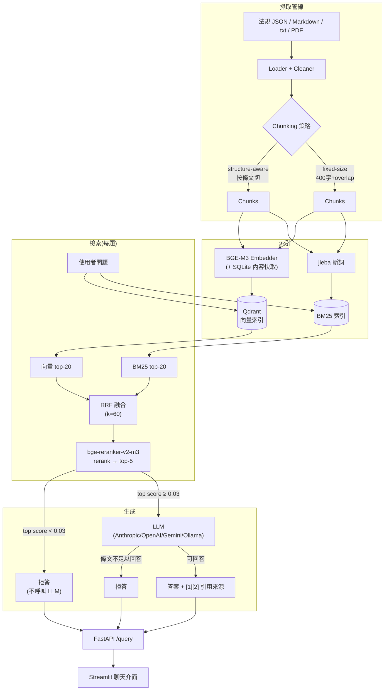

# 繁體中文 Hybrid RAG 知識問答系統 — 台灣勞動法規

[English](README.en.md) ｜ [繁體中文](README.md)

[](https://github.com/kuotunyu/tw-labor-law-rag/actions/workflows/ci.yml)

用白話問台灣勞動法規的問題（加班費怎麼算、特休有幾天、被資遣能拿多少），系統會從 15 部勞動法規、884 條條文裡找出相關條文，回答時附上法規名稱、條號與官方來源連結；條文裡找不到依據時直接拒答，不硬湊答案。給想快速查到條文依據的勞工、人資與求職者。

> **TL;DR** — Hybrid RAG over 15 Taiwanese labour statutes (884 articles): BM25 + BGE-M3 dense retrieval fused with RRF, reranked by bge-reranker-v2-m3. Answers cite the exact article; the system refuses when the law does not support an answer. FastAPI + Streamlit, Docker.


## 結果

| 指標 | 結果 | 怎麼讀 |
|---|---:|---|
| 檢索 Hit@5 | **0.967**（29/30） | 30 題可答題中，正確條文出現在前 5 筆的比例 |
| 檢索 MRR@10 | **0.906** | 正確條文排得多前面（1.0 表示永遠排第一） |
| 不可答題拒答 | **10/10** | 其中 9 題在檢索階段就擋下，不呼叫 LLM |
| 可答題被誤拒 | **1/30** | 發生在 LLM 階段；檢索門檻誤拒 0/30 |
| Faithfulness／Relevancy | **4.90／5.00**（滿分 5） | 實際作答的 29 題，由 LLM 評審打分 |
| 知識庫 | **15 部／884 條** | 13 部法律、2 部命令；2026-08-29 稽核的快照 |

以上數字來自本專案自編的 40 題正式評估集：30 題可答（涵蓋全部 15 部法規）加 10 題刻意設計成不可答，題目與標準答案皆人工對照條文查證；主設定為「按條文切塊＋Hybrid＋reranker」。

**連結：** [評估報告](EVAL_REPORT.md) ｜ [設計取捨](DESIGN.md) ｜ [逐題評估紀錄](eval/official/README.md) ｜ [English](README.en.md)。線上 Demo 部署在 Hugging Face 的 private Space（邀請制，網址不公開）；沒有邀請也能在本機跑：

```bash
uv sync                                    # Python 3.11 + uv；有 NVIDIA GPU 較快，純 CPU 也能跑
cp .env.example .env                       # 填入 Gemini 或 OpenAI 的 API key
uv run python scripts/download_corpus.py   # 下載官方開放資料（約 30MB）
uv run python scripts/build_index.py       # 建向量 + BM25 索引
uv run python scripts/ask.py "加班費怎麼算?"
```

啟動 API／前端與 Docker 的方式見 [docs/reproduce.md](docs/reproduce.md)。

## 運作方式



- **檢索：** 法規按條文切塊；BGE-M3 向量檢索與 jieba＋BM25 關鍵字檢索各取前 20 筆，用 RRF 融合，再由 bge-reranker-v2-m3 重排取前 5 筆。
- **回答：** LLM 只根據這 5 筆條文作答，答案附 [1][2] 引用；每筆引用帶法規名稱、條號、來源連結與修正／生效日期。
- **兩層拒答：** reranker 最高分低於 0.03 就直接拒答、不呼叫 LLM；通過門檻後，LLM 判斷條文不足以回答時也會拒答。
- **3 條手寫的領域查詢擴充規則**（[`src/rag/retrieval/pipeline.py`](src/rag/retrieval/pipeline.py)）：問題同時出現特定口語線索時，在「檢索用」的查詢字串後面補上固定的法規用語——(1) 雇主＋休息時間＋傳訊息 → 補「休息日、例假、工作時間、延長工作時間」等詞；(2) 資遣＋新制＋舊制＋計算 → 補「勞工退休金條例、勞動基準法、工作年資、平均工資、六個月」等詞；(3) 欠薪＋立即離職 → 補《勞動基準法》第 14 條用語。擴充後的字串只給 BM25、向量檢索與 reranker，LLM 收到的仍是使用者原句。以目前的程式碼對評估題目做字串比對，會觸發規則的題數是：40 題正式集 2 題、60 題壓力集 4 題、10 題示範回歸集 2 題。

## 結果細節

**每一段檢索管線的貢獻**（8 組消融實驗 × 40 題；下表為按條文切塊的 4 組）：

| 檢索設定 | Hit@5 | MRR@10 |
|---|---:|---:|
| 只用 BM25 | 0.833 | 0.672 |
| 只用向量 | 0.900 | 0.850 |
| Hybrid（RRF 融合） | 0.933 | 0.822 |
| **Hybrid＋reranker（主設定）** | **0.967** | **0.906** |

融合提高了命中率但排序變差，reranker 把排序救回來。固定長度切塊＋Hybrid＋reranker 的 Hit@5 較高（1.000）、MRR@10 較低（0.847）；主設定選按條文切塊，因為正確條文排得更前面、引用可以精確到單一條文。完整 8 組與 7 個失敗案例分析見 [EVAL_REPORT.md](EVAL_REPORT.md)。

**拒答：** 10 題不可答題全數拒答，9 題由 0.03 門檻直接擋下、1 題由 LLM 判定條文不足。唯一誤拒的可答題（1/30）也發生在 LLM 階段：檢索沒有把正確條文排進前 5 筆，LLM 選擇拒答而不是硬答。

**壓力測試：** 另一組 60 題（40 可答＋20 不可答）的長句、中英夾雜、錯字問法，在 2026-08-29 稽核的 15 部／884 條快照上重建索引後測得 Hit@5 **0.950**、MRR@10 **0.908**；0.03 門檻直接誤拒 **1/40**、直接擋下不可答 **17/20**。同一次執行也重現了正式集的 0.967／0.906、0/30 與 9/10。掃描 8 個門檻值後沒有任何一個在兩組題目上都更好，所以維持 0.03。

**雙模型安全抽查**（`v0.3.2 provider safety cross-check`）：Gemini `gemini-3.5-flash-lite` 與 OpenAI `gpt-5.6-luna` 各送五筆請求，每家費用上限 US$5、超過就中止。Gemini refusal accuracy `0.8`、citation success `1.0`、estimated cost `US$0.0022620`；OpenAI refusal accuracy `1.0`、citation success `1.0`、estimated cost `US$0.0026414`。每家只有五筆，這是 safety cross-check，不是模型品質評估，也不取代 `v0.1.0` 的正式評估數字；公開的逐筆紀錄嚴格不含 question/answer text、provider payload 或憑證。

**離線示範回歸與條文新鮮度：** 10 題完全離線的示範回歸（不呼叫任何 LLM）：6/6 可答題找到必要條文、10/10 檢索階段的決策符合預期。另保存 15 部／884 條逐條文的 SHA-256 指紋，可人工比對官方來源是否有條文新增、移除或變更；沒有自動排程。

<a id="scope"></a>

## 適用範圍與限制

- **評估集小、且由專案自編：** 正式集 40 題（30 題可答）、壓力集 60 題。數字代表系統在這些題目上的表現，不足以估計真實使用情境的發生率。
- **正式評估數字沿用 `v0.1.0` 那次評估的結果**，之後的版本沒有改寫。目前版本是 `v0.3.5` source-only runtime and deployment release：只發佈原始碼與部署設定；完整語料、模型權重、私有索引與 LLM 服務的原始輸出不在 repo 內。
- **Faithfulness／Relevancy 是存檔的 LLM 評審分數：** repo 可以重新加總已提交的分數，但不含完整生成答案與評審理由，無法只靠公開檔案重新評分。檢索與拒答的數字則可以離線重算。
- **0.03 門檻不是通用的「可不可答」分類器：** 壓力集已量測到 1/40 直接誤拒；實際使用測試中也觀察到同一個法律問題換成長篇口語、中英夾雜的問法就被門檻誤拒（[EVAL_REPORT.md](EVAL_REPORT.md) 案例 7）。
- **知識庫只涵蓋這 15 部法規（2026-08-29 稽核的快照）**，不是一般性的法律資料庫；法規修訂後要人工重新稽核快照並重建索引。
- 這是技術作品，不是法律意見，也不是正式上線的法律服務。

## 重現與測試

```bash
uv run python scripts/verify_release.py   # 離線重算已提交的評估數字
uv run ruff check .
uv run pytest
```

`verify_release.py` 不需要模型、API key、Qdrant 或 Docker：它用 repo 內已提交的逐題紀錄重算上面的檢索與拒答數字，並檢查公開檔案清單與隱私／金鑰掃描。完整檢查項目與測試說明見 [docs/reproduce.md](docs/reproduce.md)。

## 技術棧

| 元件 | 選擇 |
|---|---|
| Embedding | BGE-M3(FlagEmbedding,支援 CUDA) |
| Reranker | bge-reranker-v2-m3 |
| Vector DB | Qdrant(local 檔案模式 / server 模式雙支援) |
| 關鍵字檢索 | rank_bm25 + jieba(繁中詞典 + 勞動法規自訂詞) |
| 融合 | Reciprocal Rank Fusion |
| LLM | Anthropic / OpenAI / Gemini / Ollama,環境變數切換 |
| API / 前端 | FastAPI / Streamlit |
| 評估 | 自建 LLM-as-judge(faithfulness + relevancy)+ retrieval 指標(hit rate、MRR) |

## 資料來源與授權

完整知識庫語料為 15 部台灣勞動法規,來自法務部資訊處在政府資料開放平臺發布的「中文法規_法律資料檔下載」與「中文法規_命令資料檔下載」,由 `scripts/download_corpus.py` 於執行時下載;完整 dump 不隨 repository 散布(見 `.gitignore`)。

Repository 只散布兩份小型樣本供 loader/chunking 測試:`data/sample/勞工請假規則.json` 與 `data/sample/勞動基準法施行細則.json`,來源為法務部資訊處「[中文法規_命令資料檔下載](https://data.gov.tw/dataset/18290)」,依[政府資料開放授權條款第 1 版](https://data.gov.tw/license)(OGDL)可重製、散布與改作,前提是保留顯名聲明。

本 repository 的原創程式碼以 [MIT License](LICENSE) 釋出。兩份樣本與執行時下載的法規語料仍適用其原始 OGDL 條款,不因本專案採 MIT 而重新授權；Python 套件與模型等第三方元件亦各自適用其原始授權。

## 延伸閱讀

- [DESIGN.md](DESIGN.md) — 技術選型理由與 tradeoff
- [EVAL_REPORT.md](EVAL_REPORT.md) — 評估數據、消融實驗、失敗案例分析
- [eval/official/README.md](eval/official/README.md) — 可公開的正式評估產物與重現方式
- [eval/dataset/README.md](eval/dataset/README.md) — 評估集 schema 與出題原則
- [docs/changelog.md](docs/changelog.md) — v0.3.2–v0.3.5 各版本變更
- [docs/reproduce.md](docs/reproduce.md) — 本機執行、Docker、測試與 `verify_release.py` 的完整檢查項目
- [docs/private-demo.md](docs/private-demo.md) — 私有 Demo 的金鑰處理方式與雲端索引的人工更新流程
- [docs/release/](docs/release/REVIEWER_GUIDE.md) — 發佈與稽核文件：[三分鐘導覽](docs/release/V035_REVIEWER_TOUR.md)、[展示腳本](docs/release/V035_INTERVIEW_DEMO.md)、[數據對照表](docs/release/CLAIM_MATRIX.md)、[OGDL 顯名聲明與檔案雜湊](docs/release/OGDL_ATTRIBUTION.md)、[公開範圍說明](docs/release/PUBLICATION_BOUNDARY.md)
