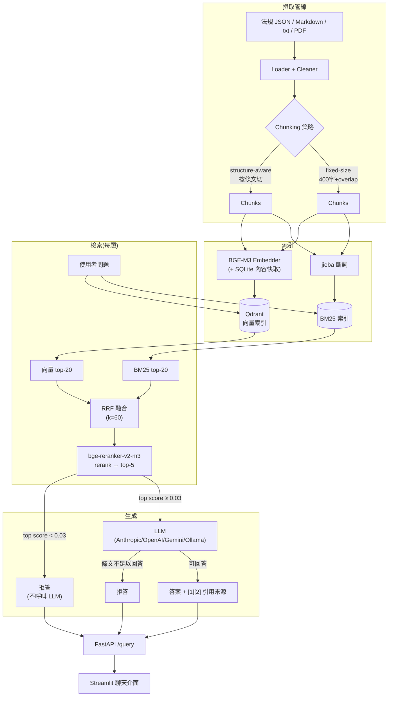
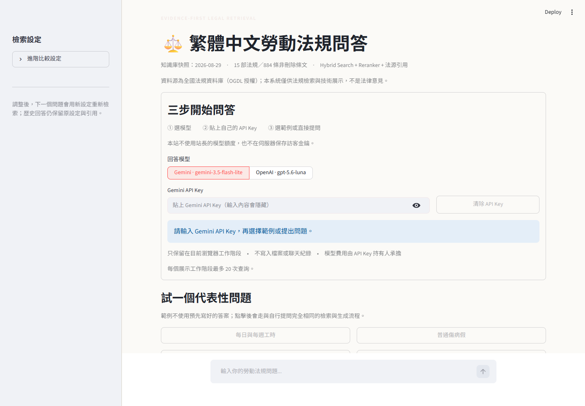

# 繁體中文 Hybrid RAG 知識問答系統

[English](README.en.md) ｜ [繁體中文](README.md)

[](https://github.com/kuotunyu/tw-labor-law-rag/actions/workflows/ci.yml)

以台灣 15 部勞動法規（13 部法律、2 部命令）為目標知識庫的檢索增強生成(RAG)問答系統:BM25 + BGE-M3 向量檢索以 RRF 融合,經 bge-reranker-v2-m3 重排序後生成附條文引用的答案,回答附上法規、條號、法規來源連結與修正／生效日期,查無依據時誠實拒答而非瞎掰。設計決策由 40 題正式評估、8 組消融實驗與 60 題可靠性壓力集檢驗——見 [EVAL_REPORT.md](EVAL_REPORT.md)。

## 正式評估摘要

`structure-aware + Hybrid + reranker` 在 40 題評估集中的 30 題可答子集,檢索 `Hit@5` 為 **0.967**、`MRR@10` 為 **0.906**。10 題不可答題最終全數拒答,其中 **9/10** 由 threshold 直接擋下且不呼叫 LLM,另 1 題由 LLM 判定條文不足;同時有 **1/30** 可答題在 LLM 層被誤拒(threshold 層誤拒為 0/30)。上述 retrieval、answerability 與 refusal 算術可從 committed privacy-reduced traces 完整離線重算。

實際作答的 29 題平均 faithfulness **4.90/5**、relevancy **5.00/5** 則屬 **archived provider evidence**:repository 可離線重新聚合已提交的 judge 數字,但不含完整生成答案、judge 理由或 provider response,因此不能從公開 evidence 重新產生或獨立複判這些評分。完整方法與限制見 [EVAL_REPORT.md](EVAL_REPORT.md),去識別化逐題 trace 見 [`eval/official/`](eval/official/README.md),claim 到 evidence 的映射見 [claim matrix](docs/release/CLAIM_MATRIX.md)。

`v0.3.1 reliability stress evidence` 另以 40 題可答、20 題不可答的長句／中英夾雜壓力集，對 2026-08-29 稽核的 **15 部／884 條** snapshot 重建隔離索引。主設定 Hit@5 **0.950**、MRR@10 **0.908**；0.03 門檻直接誤拒 **1/40**、直接攔下不可答 **17/20**。既有 40 題正式集 guard 同時重現 Hit@5 **0.967**、MRR@10 **0.906**、門檻誤拒 **0/30** 與直接攔截 **9/10**。門檻掃描沒有 Pareto-better 候選，因此保留 0.03，不以新壓力集改寫 `v0.1.0` 正式模型品質指標。

Gemini `gemini-3.5-flash-lite`／OpenAI `gpt-5.6-luna` 的 US$5 硬上限 cross-check 執行器已完成並 fail closed；本機沒有本專案專用金鑰，所以正式 provider evidence 目前明確是 **`pending_credentials`**，沒有挪用其他專案 `.env`、沒有替換模型，也沒有聲稱已執行。

### Release evidence boundary

`uv run python scripts/verify_release.py` 不載入模型、不呼叫 provider、不啟動 Qdrant/Docker,會核對 40 題正式集、60 題壓力集、8×40 ablation grid、Hit@5/MRR、0.03 threshold sweep、15 部／884 條 snapshot、設定一致性、OGDL samples、official trace schema、provider pending contract、完整 publication inventory、secret/privacy scan、人工審閱 binary hashes 與 GitHub Action pins。Git 歷史稽核涵蓋 heads、tags、remotes 的所有可公開 commits；GitHub Actions 暫時產生、不可發布的 `refs/remotes/pull/*` 合成 merge refs 除外，本機 `refs/archive/*` recovery evidence 也會保留在 publication graph 之外。0.03 reranker threshold 不是通用 answerability classifier；壓力集已量測到 1/40 直接誤拒，因此只保留現值而不宣稱問題已消失。

## v0.3.1 可靠性、來源與雙模型 runtime

這是 `v0.3.1` source-only runtime and deployment release。公開 API/UI 預設使用 Gemini `gemini-3.5-flash-lite`，若伺服器同時設定 OpenAI，使用者可逐次請求選擇 `gpt-5.6-luna`。這些型號可分別由 server-side `GEMINI_GENERATION_MODEL` 與 `OPENAI_GENERATION_MODEL` 覆寫；對應 key 已設定時，`LLM_PROVIDER=gemini` 決定省略請求選擇時的預設 provider，否則 API 會改用另一個已設定的公開 provider；`LLM_FALLBACK_ENABLED=true` 才允許備援。`GEMINI_API_KEY` 與 `OPENAI_API_KEY` 只存在 API 伺服器環境，前端不接收、保存或顯示 key。

備援邊界是固定的：只有主 provider 發生連線、限流、5xx 服務或空回應等 operational failure 時，才會最多嘗試另一個已設定的公開 provider 一次。檢索階段拒答不會呼叫生成模型；模型依據條文拒答、provider 安全擋下或政策拒絕也不會 fallback。正式評估路徑仍直接固定單一 generator/judge provider，不使用 runtime fallback，避免路由變動改寫評估設定。

Streamlit 側邊欄的「回答模型」只顯示 API `/models` 回傳的已設定 Gemini/OpenAI；送出問題時會將選擇的 provider 一併傳給 `/query`。回應中 `requested_provider` 保留指定 provider，`provider` 與 `model` 是實際生成結果的 metadata，`fallback_used`/`fallback_from` 說明是否改走備援，`generation_called=false` 表示在檢索層已拒答。UI 會分開顯示指定與實際作答模型，並在改走備援時警示。Live provider smoke test 需要伺服器端本機 secrets，不屬公開 offline CI。

`v0.1.0` 的正式模型品質指標仍是歷史結果，由 `release/manifest.json` 所列 generator 與 judge 模型產生；本版沒有取代或重新審計這些數值。本版已在不呼叫 provider 的情況下，以 60 題壓力集與既有 40 題正式集 guard 重跑 retrieval 與 threshold 行為。

### 公開 BYOK Docker Space（已上線）

**Live Demo：** [steven0226-tw-labor-law-rag-demo.hf.space](https://steven0226-tw-labor-law-rag-demo.hf.space)

公開作品集模式採 BYOK（Bring Your Own Key）：訪客選擇 Gemini `gemini-3.5-flash-lite` 或 OpenAI `gpt-5.6-luna`，並在遮罩欄位輸入自己的專用 API Key。Key 只存在目前 Streamlit 工作階段、送往同容器 loopback FastAPI 的單次內部 header，以及該次請求建立的 provider client；不寫入檔案、聊天紀錄、共用設定或跨請求快取。公開 Space 不設定站長的 `GEMINI_API_KEY`／`OPENAI_API_KEY`，也不做跨 provider fallback，因此訪客不會消耗站長的模型 token 額度。

Space 只持有 Qdrant 兩個法規 collections 的唯讀 Key；建索引使用的短期 write/manage Key 於本機完成後立即撤銷。啟動時只讀 scroll payload，在記憶體重建 structure/fixed 兩份 BM25，不把私有 `data/raw/` 或 `storage/bm25_*.json` 放入 image。預設每個展示工作階段 20 題、全域同時 2 題、單題 timeout 60 秒，最多保留 1,000 個未過期的匿名工作階段。公開前已完成 Key 隔離、唯讀權限與免費 `cpu-basic` 驗收；完整操作與 rollback 見 [BYOK Hugging Face runbook](docs/deployment/BYOK_HUGGINGFACE_RUNBOOK.md)。

## 架構



## Quickstart

需求:Python 3.11、[uv](https://docs.astral.sh/uv/)。有 NVIDIA GPU 可大幅加速 embedding/rerank,純 CPU 也能跑(較慢)。

```bash
# 1. 安裝依賴
uv sync

# 2. 設定環境變數（公開 API/UI 至少在伺服器端填 Gemini / OpenAI 一組 key）
cp .env.example .env
# 編輯 .env，填入對應 API key；不要將 .env 提交到 Git

# 3. 下載語料(全國法規資料庫官方開放資料,約 30MB,首次執行)
uv run python scripts/download_corpus.py

# 4. 建索引(向量 + BM25,兩種 chunking 策略各一份;有 GPU 約 1 分鐘)
uv run python scripts/build_index.py

# 5. 命令列問答(開發用,免啟動伺服器)
uv run python scripts/ask.py "加班費怎麼算?"

# 6. 或啟動 API + 前端
uv run python scripts/run_api.py &          # http://localhost:8000/docs
uv run streamlit run ui/app.py              # http://localhost:8501
```

### 用 Docker(Qdrant server mode)

```bash
docker compose up -d qdrant
# 將 .env 的 QDRANT_MODE 改為 server,QDRANT_URL 保持 http://localhost:6333
uv run python scripts/build_index.py --strategy all      # 對 Qdrant 服務建兩種索引
docker compose up --build api ui
```

### 跑測試與評估

測試與 release verifier 不依賴 GPU、模型權重、Qdrant 或真實 LLM API;heavy components 皆延遲載入,unit tests 使用純邏輯、fixture、cache 或明確的 test double。[GitHub Actions](.github/workflows/ci.yml) 會在 `main` push、`v*` tag push 與所有 pull request 執行。

```bash
uv run python scripts/verify_release.py          # committed evidence 離線重算與公開邊界稽核
uv run ruff check .                             # locked lint gate
uv run pytest                                    # 單元、正式產物、privacy 與 package 測試
uv build                                         # sdist + wheel;驗證 runtime dictionary 有打包
```

重新執行 `eval/ablation.py` 需要既有索引與本機模型;`eval/run_e2e_eval.py` 還需要 provider,不屬於公開離線 reviewer path。可公開、去識別化的正式指標與逐題 trace 已收錄在 [`eval/official/`](eval/official/README.md);`eval/runs/` 保留原始本機執行結果,不進版控。完整 clean reviewer 步驟見 [REVIEWER_GUIDE.md](docs/release/REVIEWER_GUIDE.md)。

### Demo 截圖



## 技術棧

| 元件 | 選擇 |
|---|---|
| Embedding | BGE-M3(FlagEmbedding,支援 CUDA) |
| Reranker | bge-reranker-v2-m3 |
| Vector DB | Qdrant(local 檔案模式 / server 模式雙支援) |
| 關鍵字檢索 | rank_bm25 + jieba(繁中詞典 + 勞動法規自訂詞) |
| 融合 | Reciprocal Rank Fusion |
| LLM | Anthropic / OpenAI / Gemini / Ollama,環境變數切換 |
| API / 前端 | FastAPI / Streamlit |
| 評估 | 自建 LLM-as-judge(faithfulness + relevancy)+ retrieval 指標(hit rate、MRR) |

每個選擇的理由與 tradeoff 見 [DESIGN.md](DESIGN.md)。

## 專案文件

- [DESIGN.md](DESIGN.md) — 技術選型理由與 tradeoff
- [EVAL_REPORT.md](EVAL_REPORT.md) — 評估數據、消融實驗、失敗案例分析
- [eval/official/README.md](eval/official/README.md) — 可公開的正式評估產物與重現方式
- [eval/dataset/README.md](eval/dataset/README.md) — 評估集 schema 與出題原則
- [README.en.md](README.en.md) — calibrated English portfolio summary
- [docs/release/](docs/release/REVIEWER_GUIDE.md) — claim matrix、OGDL attribution、publication/privacy boundary 與 reviewer path

## 資料來源與授權

完整知識庫語料為 15 部台灣勞動法規,來自法務部資訊處在政府資料開放平臺發布的「中文法規_法律資料檔下載」與「中文法規_命令資料檔下載」,由 `scripts/download_corpus.py` 於執行時下載;完整 dump 與其餘 13 部 normalized corpus 不隨 repository 散布(見 `.gitignore`)。

Repository **有散布兩份小型 OGDL 命令樣本**供 loader/chunking smoke test:`data/sample/勞工請假規則.json` 與 `data/sample/勞動基準法施行細則.json`。兩者來源為法務部資訊處「[中文法規_命令資料檔下載](https://data.gov.tw/dataset/18290)」,依[政府資料開放授權條款第 1 版](https://data.gov.tw/license)可重製、散布與改作,前提是保留顯名聲明。完整 attribution、snapshot hashes 與再散布結論見 [OGDL_ATTRIBUTION.md](docs/release/OGDL_ATTRIBUTION.md)。

本 repository 的原創程式碼以 [MIT License](LICENSE) 釋出。兩份 samples 與執行時下載的法規語料仍適用其原始 OGDL 條款,不因本專案採 MIT 而重新授權；Python 套件與模型等第三方元件亦各自適用其原始授權。

## 公開範圍

這是 `v0.3.1` source-only runtime and deployment release。正式模型品質指標沿用未變更的 `v0.1.0` formal evidence baseline；本版新增完整 corpus snapshot、逐引用法源 provenance、60 題可靠性壓力證據與嚴格預算雙 provider 執行器。正式 Gemini／OpenAI cross-check 因本機未配置本專案專用金鑰，明確標為 `pending_credentials`，沒有以其他專案金鑰或模型代跑。它是 evidence-backed software portfolio artifact，不是法律意見，也不是 production legal service。完整 corpus、模型權重、私有索引與 provider raw artifacts 仍不在本次 source release 範圍。
