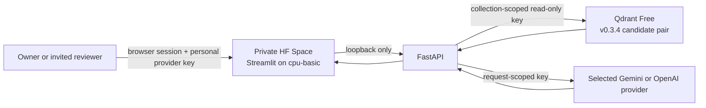

# v0.3.5 Portfolio Readiness & Evidence Hardening Design

**Status:** Approved design, pending written-spec review

**Date:** 2026-08-30

**Audience priority:** hiring managers and technical interviewers first, end users second, engineers and researchers as the evidence audience

**Release type:** source, documentation, UI, evaluation-contract, and private-deployment hardening

## 1. Objective

v0.3.5 turns an already evidence-backed Taiwan labor-law RAG project into a portfolio artifact that can be understood quickly without weakening its engineering or safety boundaries.

The intended reviewer journey is:

- understand the problem and project value within 30 seconds;
- understand the architecture, measured results, and security boundary within 3 minutes;
- reproduce the main offline claims within 15 minutes after dependencies are installed;
- inspect detailed evaluation, failure cases, and design tradeoffs when deeper review is desired.

This release does not treat visual polish as a substitute for evidence. Every new quality claim must be backed by a deterministic test, committed evaluation artifact, or explicitly classified provider evidence.

## 2. Current Baseline

The design starts from the `origin/main` state after the v0.3.4 targeted regression evidence and blue-green Qdrant maintenance work.

The baseline already provides:

- a 15-law, 884-article audited snapshot;
- structure-aware and fixed-size chunking;
- BM25 plus BGE-M3 retrieval, RRF fusion, and bge-reranker-v2-m3;
- a retrieval threshold that can refuse before an LLM call;
- 40-question formal evidence, 60-question reliability stress evidence, eight ablations, and targeted wage-arrears regression evidence;
- privacy-reduced committed traces and an offline release verifier;
- a secure visitor-BYOK Streamlit/FastAPI runtime;
- a private Hugging Face Docker Space on free CPU hardware;
- a Qdrant Free cluster with collection-scoped, read-only runtime access;
- blue-green candidate collections and rollback collections;
- green CI, package builds, security scans, and 578 baseline tests.

The main gaps are presentation and state alignment, a curated reviewer-facing demonstration contract, a manual freshness workflow, and a concise path from portfolio overview to deep evidence.

## 3. Design Principles

1. **Evidence before adjectives.** Prefer a linked result or limitation over unmeasured claims such as “highly accurate.”
2. **Progressive disclosure.** Ordinary users see a three-step question flow; advanced retrieval controls and debug metadata remain available but secondary.
3. **No owner-funded public inference.** Visitors supply their own Gemini or OpenAI key. The deployment contains no owner LLM key.
4. **Free infrastructure remains a hard boundary.** Qdrant Free and Hugging Face `cpu-basic` remain unchanged.
5. **Private before public.** v0.3.5 does not change Space visibility. Public launch remains a separately approved option.
6. **Historical evidence stays historical.** New targeted results do not rewrite the v0.1.0 formal baseline or v0.3.1 reliability baseline.
7. **Manual legal-data changes.** Freshness checks may be automated as a command, but indexing and cutover require an attended human decision and temporary writer key.
8. **Reversible operations.** Old Qdrant collections and old local repositories are retained until a separately reviewed cleanup is safe.

## 4. Considered Approaches

### 4.1 Portfolio-first, then evidence hardening — selected

Improve the reviewer journey and user interface first, then add a small, deterministic demonstration regression suite and manual freshness workflow.

This gives the highest interview value with low infrastructure and regression risk. It preserves the existing technical depth rather than replacing it.

### 4.2 Research-first expansion — deferred

Expand the benchmark substantially, add more laws, and run new provider judging before improving presentation.

This would deepen research credibility, but it is slower, may incur provider cost, and does not solve the immediate problem that a reviewer must currently read several long documents to understand the project.

### 4.3 Public-product launch — optional later

Make the Space public and prioritize onboarding, abuse controls, and service reliability.

This improves direct accessibility but exposes free Qdrant and Hugging Face resources to anonymous demand. It conflicts with the owner's current cost and abuse preference, so v0.3.5 remains private.

## 5. Scope

### 5.1 In scope

- reorganize the Traditional-Chinese and English README openings;
- align repository, release, Qdrant, and private Space status language;
- refresh screenshots from the actual v0.3.5 interface;
- add a concise reviewer tour and interview demonstration script;
- improve the Streamlit information hierarchy and BYOK onboarding;
- move expert retrieval settings behind progressive disclosure;
- improve answer, citation, refusal, and error presentation;
- add a curated 6–10-question demonstration regression set;
- strengthen citation and cross-law retrieval contracts;
- add or document a manual, read-only corpus freshness check;
- provide one clear offline reviewer command or wrapper;
- update claim mappings, release inventory, and reviewer documentation;
- ship an immutable v0.3.5 tag and GitHub Release after all gates pass;
- deploy the same verified revision to the private Hugging Face Space.

### 5.2 Out of scope

- making the Hugging Face Space public;
- paid GPU, persistent storage, replicas, monitoring services, or schedules;
- automatically purchasing or consuming model credits;
- expanding beyond the existing 15-law target corpus;
- changing BGE-M3, the reranker, Qdrant, RRF, or the 0.03 threshold without separate evaluation evidence;
- deleting rollback collections;
- changing provider routing or generation prompts unless a demonstrated defect requires it;
- claiming legal correctness, production legal-service readiness, or real-time legal freshness;
- destructive cleanup of legacy local repositories.

## 6. Portfolio Information Architecture

### 6.1 README opening

The first screen of each README will contain:

1. a one-sentence problem and solution statement;
2. four evidence-backed highlights:
   - 15 laws and 884 articles;
   - Hybrid Search plus reranking;
   - measured retrieval and refusal behavior;
   - visitor BYOK with no owner-funded model tokens;
3. the current interface image;
4. three paths:
   - **3-minute reviewer tour**;
   - **reproduce the evidence**;
   - **architecture and limitations**;
5. an accurate deployment label: the live Space is private and owner-controlled, not an anonymous public demo.

Long release history stays available but moves below the main reviewer journey so version chronology does not obscure project value.

### 6.2 Reviewer tour

The reviewer tour will answer, in order:

- What user problem does this solve?
- Why is hybrid retrieval appropriate for legal Chinese?
- What was measured, and what was not?
- How does refusal prevent unsupported answers and unnecessary provider calls?
- How are API keys and infrastructure costs isolated?
- Which limitations remain?

## 7. Interface Design

### 7.1 Visual direction

The interface uses a restrained “legal dossier plus engineering evidence” direction: calm neutral surfaces, ink-like typography, a limited statutory-red or amber accent, deliberate spacing, and high contrast. It avoids generic purple-gradient AI styling and decorative motion that competes with legal content.

Implementation complexity must remain appropriate for Streamlit. Small, stable CSS adjustments are acceptable; a framework rewrite is not.

### 7.2 Primary user flow

The main flow is explicitly three steps:

1. choose Gemini or OpenAI;
2. paste a personal API key into a masked field;
3. choose a sample question or enter a labor-law question.

The key card states:

- the key remains in the current browser work session;
- it is sent only to the same-container loopback API for the request;
- it is not written to files or chat history;
- model fees belong to the key holder;
- “key entered” does not mean the provider has validated the key.

### 7.3 Example questions

Examples are grouped by user intent rather than model capability:

- working hours and overtime;
- leave;
- wage arrears and immediate termination;
- old-versus-new severance rules;
- an out-of-domain question that demonstrates refusal.

Selecting an example populates or submits the question through the same production path; examples must not use special answer logic.

### 7.4 Advanced controls

Chunking, retrieval mode, and reranker controls move into an “advanced comparison settings” section. They remain available because they demonstrate the project's ablation-oriented design, but they no longer dominate the first screen.

### 7.5 Answer hierarchy

Each answer presents:

1. the concise conclusion;
2. necessary qualifications or conditions;
3. cited law and article sources;
4. source URL and amendment/effective metadata when available;
5. optional provider and retrieval-debug metadata.

A retrieval-stage refusal remains visibly distinct and states that no generation model was called. A model-stage refusal must not be represented as a retrieval refusal.

### 7.6 Error handling

Errors remain sanitized and actionable:

- missing key: identify the missing step;
- invalid key or session: ask the user to verify or re-enter it;
- rate limit: explain that the selected provider or demo quota is limiting the request;
- timeout: invite retry without displaying provider response bodies;
- unavailable corpus or model catalog: fail closed and do not enable submission;
- unknown failures: display a generic retry message and keep secrets out of the exception object retained by UI state.

### 7.7 Accessibility and responsive behavior

Acceptance includes:

- keyboard access to provider selection, key controls, examples, expanders, and question submission;
- no meaning conveyed by color alone;
- readable contrast for success, warning, refusal, and error states;
- meaningful labels for masked key controls and buttons;
- no horizontal scrolling at narrow viewport width;
- citation links distinguishable from surrounding text;
- stable content order when the sidebar collapses.

## 8. Demonstration Regression Design

### 8.1 Dataset

Create a versioned 6–10-question dataset that covers:

- single-law numeric or list questions;
- at least two cross-law questions;
- long or conversational wording;
- the wage-arrears/immediate-termination route;
- the old/new severance route;
- at least two unanswerable or out-of-domain questions;
- at least one known hard or limitation case.

Each record defines:

- stable identifier;
- question category and answerability;
- expected law/article targets;
- required or prohibited retrieval targets;
- expected refusal stage where deterministic;
- rationale suitable for human review;
- snapshot and code revision bindings in the results artifact.

Question text may be committed because it is purpose-written public evaluation content. Provider keys, provider payloads, raw answers, private paths, and API metadata remain excluded.

### 8.2 Deterministic acceptance

The primary acceptance is retrieval and policy behavior, not exact generated prose:

- required targets appear within the declared rank boundary;
- collision cases do not trigger targeted expansions;
- answerable cases do not fail the deterministic threshold unexpectedly;
- unanswerable cases follow the expected pre-generation behavior where specified;
- a retrieval refusal records `generation_called=false`;
- result counts, hashes, configuration, and code revision are internally consistent.

New provider calls are not required for this release unless generation or provider routing changes. Existing provider evidence remains historical and clearly labeled.

## 9. Citation and Legal-Quality Contracts

The runtime and tests must preserve these boundaries:

- a generated citation can refer only to a source included in the current retrieval context;
- citation index, law name, article label, source URL, amendment date, and effective date remain internally aligned;
- cross-law demonstration cases retain all required laws in the final context;
- lack of sufficient retrieved authority leads to refusal rather than invented synthesis;
- successful citation formatting is not described as proof that the legal conclusion is correct;
- the UI and README identify the snapshot date and state that the system is not legal advice.

## 10. Manual Freshness Workflow

No recurring automation is introduced.

The attended workflow is:

1. run a read-only official-source download or comparison command;
2. audit the candidate corpus and generate a non-secret diff report;
3. report added, changed, deleted, and unchanged target-law articles;
4. stop when there is no approved change;
5. when approved, create a short-lived collection-scoped writer key;
6. build new uniquely named fixed and structure collections;
7. verify snapshot hashes, counts, dimensions, distance metric, payload provenance, and retrieval regressions;
8. create a transition reader, deploy the candidate collection base, and run private acceptance;
9. create the final candidate-only reader and revoke all transition/writer keys;
10. retain old collections for rollback until a separately reviewed capacity decision.

The repository documents the process and can provide commands, but it never creates a paid cluster or unattended credential.

## 11. Deployment and Cost Boundary

The v0.3.5 deployment remains:

Hard constraints:

- one free CPU replica;
- no persistent paid storage;
- no owner Gemini/OpenAI key in Space secrets;
- only `QDRANT_API_KEY` and `SESSION_SIGNING_SECRET` are expected secrets;
- no cross-provider fallback in public-BYOK mode;
- bounded query count, concurrency, question length, and timeout;
- no logging of questions, answers, keys, provider bodies, session tokens, or Qdrant credentials.

Most UI acceptance uses test doubles. A new live provider smoke test requires separate cost authorization if provider or generation behavior changes.

## 12. Release and Rollback

Implementation occurs in an isolated worktree and follows TDD for every behavior change.

Release gates include:

- locked dependency verification;
- Ruff;
- Bandit medium/high findings gate;
- `pip-audit` with the existing custom CUDA-wheel interpretation;
- full pytest suite;
- release verifier and publication/privacy scan;
- package build and clean imports;
- desktop and narrow-viewport UI checks;
- private Space BYOK and Qdrant read-only acceptance;
- independent code and design review.

After all gates pass:

1. merge the reviewed PR with the repository's linear-history policy;
2. create an immutable `v0.3.5` tag and GitHub Release;
3. deploy that verified source revision to the private Space;
4. record source revision, Space revision, hardware tier, collection base, point counts, and non-secret acceptance outcomes;
5. do not record endpoints, keys, session tokens, provider payloads, or private local paths in public evidence.

Rollback changes the Space back to the previous verified source revision and collection base. It does not rewrite GitHub history or delete collections during an incident.

## 13. Local Repository Hygiene

Local cleanup occurs only after v0.3.5 is released and is a separate reversible maintenance task.

The task will:

- inventory the canonical repository, legacy outer repository, nested candidate, worktrees, private corpus, indexes, caches, and environment files;
- record resolved paths, Git heads, remotes, sizes, and selected hashes without exposing secret values;
- move obsolete source copies to an explicit archive location rather than deleting them;
- preserve `.env`, private corpus, model cache, evaluation runs, and rollback receipts outside the public repository;
- avoid `git reset --hard`, history rewriting, or recursive deletion.

## 14. Testing Matrix

| Area | Required evidence |
|---|---|
| README claims | link and value checks plus release-verifier inventory |
| UI onboarding | provider/key/session state tests and rendered-copy checks |
| API-key privacy | request/header tests, retained-object checks, and public scan |
| Example questions | same production request path; no hard-coded answers |
| Retrieval regression | committed dataset, deterministic runner, results artifact, verifier |
| Cross-law behavior | required target coverage and collision negatives |
| Refusal behavior | stage, score, and `generation_called` contracts |
| Citations | context membership and metadata alignment |
| Accessibility | automated structure checks where practical plus desktop/narrow manual review |
| Free deployment | private visibility, cpu-basic, one replica, no paid storage |
| Qdrant least privilege | candidate read succeeds; write and old-collection reads fail |
| Release integrity | CI, build, privacy/history scan, immutable tag, deployment receipt |

## 15. Success Criteria

v0.3.5 is complete only when:

1. the README opening communicates problem, architecture, evidence, cost boundary, and private-demo status without contradictory language;
2. a first-time user can understand and complete the three-step BYOK flow;
3. advanced comparison controls remain available without dominating the default experience;
4. the curated demonstration regression is offline reproducible and all claims map to evidence;
5. citation, refusal, cross-law, and privacy contracts pass;
6. all existing formal and reliability evidence remains unchanged unless explicitly versioned;
7. all CI, test, security, build, and release-verification gates pass;
8. the private Space runs the same verified release on free CPU and candidate-only read access;
9. no paid infrastructure, schedule, public visibility, or owner-funded visitor inference is introduced;
10. rollback remains possible without deleting the previous Qdrant collections.

## 16. Risks and Mitigations

| Risk | Mitigation |
|---|---|
| UI polish obscures evidence | Keep metrics linked and limitations adjacent to claims |
| Streamlit customization becomes brittle | Prefer native components and minimal stable CSS |
| README becomes longer | Use a short top-level journey and move detail behind links |
| Demonstration set overfits known examples | Include collision negatives, hard cases, and preserve existing broad guards |
| “Fresh” is mistaken for real time | Display snapshot date and document manual update semantics |
| New tests imply legal correctness | Label them retrieval/policy contracts, not legal certification |
| Anonymous traffic consumes free resources | Keep Space private in v0.3.5 |
| Maintenance key survives too long | Short expiry, attended operation, immediate revocation verification |
| Local cleanup removes recovery data | Inventory and archive; do not delete in the release task |

## 17. Delivery Order

1. README/reviewer-tour information architecture and truthful state alignment.
2. UI onboarding and progressive-disclosure behavior with tests.
3. Curated demonstration regression and citation/cross-law contracts.
4. Manual freshness workflow and documentation.
5. Screenshots, reviewer guide, claim matrix, and release inventory.
6. Full verification, private Space acceptance, PR, immutable v0.3.5 release, and deployment receipt.
7. Separate reversible local-repository hygiene review after release.

Implementation planning begins only after this written specification is reviewed.
